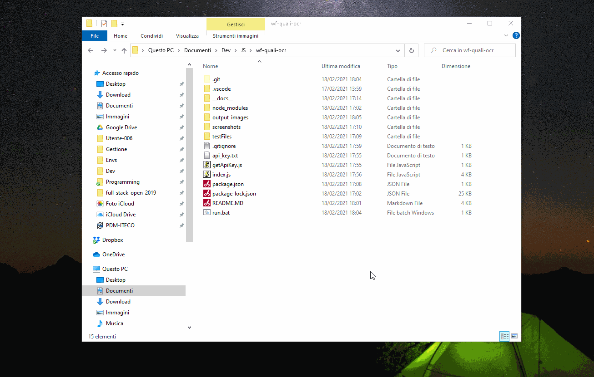

# wf-quali-ocr

This is a script that facilitates organizing qualifying sessions in [Wreckfest](https://order.wreckfestgame.com/). Qualifying is not official in the game but there are various communities that organize race events that require qualifying.

Usually this happens so that at the start of an event there is a race of, for example, 5 laps and the driver with the fastest lap time wins the qualification. The result screen of the game is organized in finishing order, so the data from the game must be extracted elsewhere (Excel...) to be sorted out manually. This is a tedious process and requires writing lap times in a spreadsheet in MM:SS:sss format by hand.

This script aims to facilitate that process and uses OCR (_Optical Character Recognition_) to extract the necessary data from the screenshots and outputs the data in a `.txt` file for later elaboration.

# Requirements

To run the script, you need to have [Node.js](https://nodejs.org/en/) installed on you computer. I developed this with the version `15.3.0`, but it should work with any version that supports `async/await` syntax (ie `>7.6`).

The script uses a free API ([OCR.space(https://ocr.space/)]) for the OCR part, but an API key is required. You can get yourself one from [here](https://ocr.space/OCRAPI). You will have to give them your email and verify it the address. Then they will send the key to your inbox. Check **Installation** chapter below in the instruction for where to put the API key.

# Instructions

## Installation

1. Download Node and install it if you don't have it already.
2. Download the package from GitHub as a ZIP folder to your PC so a location of your preference.
3. Navigate to the folder.
4. Open command prompt / powershell in that folder. You can open powershell by `shift + right clicking` somewhere withing the folder and by selecting `Open Powershell window here`.
5. Run `npm install`
6. Create a new `.txt` file in the script directory called `api_key.txt`.
7. Paste your API key there from your email.

## Usage

1. Before running the script, you need to have 1 or 2 screenshots in the `screenshots` folder. If the event has more than 16 drivers, the result screen becomes scrollable. You need a screenshot starting from the first position and another one starting from the last. The screenshot must be a **full screen** screenshot. Do not crop! By default Steam let's you take screenshots by fittin `F12`. **Currently only 1920x1080 screenshots are supported**.
2. Delete any previous screenshots from the folder. The maximum amount of screenshots allowed is 2, so you can run the script only for one event at a time. In this repository there are already 2 example screenshots in the folder. Feel free to try the functionality with them.
3. To run the script, just click the `run.bat` file in the script directory.
4. `results.txt` gets created in the script directory.
5. Open the file, copy the results and paste them where ever you please.
6. ???
7. Profit

Please note that the images in the `output_directory` can be removed once you have the results if you don't want to save they. They are just temp files used for the OCR.

Here is a gif animation that illustrates the functionality:

